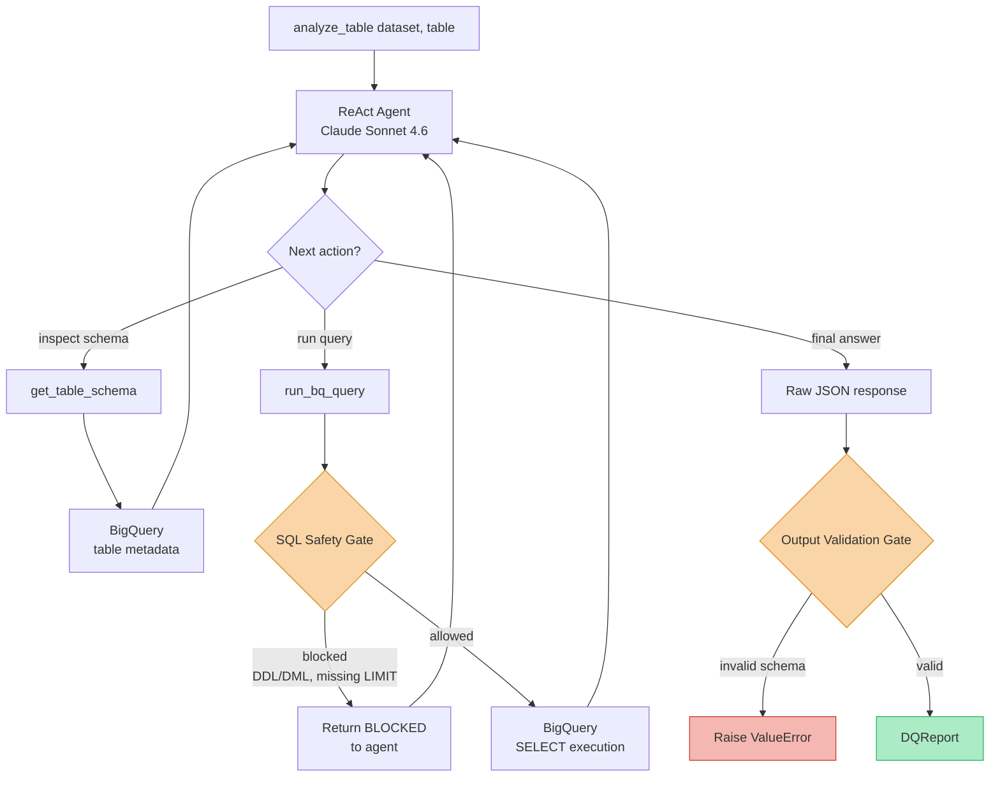

# Data Quality Agent

[]()

A LangGraph agent that analyzes BigQuery tables and produces structured data quality reports. Powered by Claude (Anthropic) and hardened with a safety harness that blocks dangerous SQL and validates every output.

## Features

- **Automated DQ analysis** — detects nulls, duplicates, and outliers via natural language instructions to Claude
- **SQL safety harness** — allows only `SELECT` statements with a required `LIMIT`; blocks all DDL/DML (`DELETE`, `UPDATE`, `DROP`, etc.)
- **Structured output validation** — every agent response is parsed and validated against a `DQReport` Pydantic schema before being returned
- **Structured JSON logging** — all tool calls and analysis steps are logged with metadata (session ID, table, duration, bytes processed)
- **LangSmith tracing** — full execution traces available in the `dq-agent-project` LangSmith project

## Stack

| Layer | Technology |
|---|---|
| Agent framework | LangGraph + LangChain |
| LLM | Claude Sonnet (`claude-sonnet-4-6`) |
| Data warehouse | Google Cloud BigQuery |
| Schema validation | Pydantic v2 |
| Config | python-dotenv |
| Linting | Ruff |
| Type checking | mypy |
| Testing | pytest + pytest-cov |

## Project Structure

```
src/
├── agent.py        # Entry point — builds the ReAct agent and exposes analyze_table()
├── tools.py        # LangChain tools: get_table_schema, run_bq_query
├── harness.py      # Safety gates: sql_safety_gate, validate_output, DQReport schema
├── config.py       # Settings loaded from environment variables
└── logging_config.py  # Structured JSON logger setup
tests/
AGENTS.md           # System prompt injected into the agent
```

## Execution Flow

The agent runs a **ReAct loop** (reason → act → observe) wrapped by two harness gates: one on every SQL query and one on the final output.



**Step by step:**

1. `analyze_table()` creates a session ID and invokes the agent with a natural-language instruction (e.g. *"Analyze dataset.table: check for nulls, duplicates, outliers"*)
2. The ReAct agent reasons about the task and typically starts by calling `get_table_schema` to understand column types
3. Based on the schema, it issues one or more `run_bq_query` calls — each one is filtered by `sql_safety_gate` before hitting BigQuery
4. When the agent believes it has enough evidence, it returns a JSON response
5. `validate_output` parses the JSON and enforces the `DQReport` Pydantic schema — malformed output raises `ValueError` instead of leaking to the caller

## Output Schema

Every successful run returns a `DQReport`:

```json
{
  "table": "my_dataset.my_table",
  "total_rows": 150000,
  "issues": [
    {
      "severity": "high",
      "field": "email",
      "issue": "15% null values detected",
      "count": 22500
    }
  ],
  "summary": "Found 3 data quality issues. One high-severity null rate on email field."
}
```

Severity levels: `low` | `medium` | `high` | `critical`

## Quick Start

```bash
# 1. Clone and set up the environment
python -m venv .venv
source .venv/bin/activate
pip install -r requirements.txt

# 2. Configure credentials
cp .env.example .env
# Edit .env with your ANTHROPIC_API_KEY, GOOGLE_CLOUD_PROJECT, BQ_DATASET, BQ_TABLE

# 3. Run
python src/agent.py
```

## Docker

The project ships with a multi-stage `Dockerfile` that builds a slim `python:3.11-slim` runtime image, installs dependencies in a separate builder stage for better caching, and runs as a non-root `agent` user.

### Build

```bash
docker build -t dq-agent .
```

### Run

Pass your credentials via an `.env` file:

```bash
docker run --rm --env-file .env dq-agent
```

If you authenticate to BigQuery via a service account key, mount it into the container and point `GOOGLE_APPLICATION_CREDENTIALS` at the mounted path:

```bash
docker run --rm \
  --env-file .env \
  -v $HOME/.config/gcloud/sa-key.json:/secrets/sa-key.json:ro \
  -e GOOGLE_APPLICATION_CREDENTIALS=/secrets/sa-key.json \
  dq-agent
```

### Notes

- The image runs `python -m src.agent` as its default command
- Tests, `.venv/`, `.git/`, and markdown files (except `AGENTS.md`) are excluded via `.dockerignore`
- The container runs as a non-root user (`agent`) for security

## Environment Variables

| Variable | Description |
|---|---|
| `ANTHROPIC_API_KEY` | Anthropic API key |
| `GOOGLE_CLOUD_PROJECT` | GCP project ID |
| `BQ_DATASET` | Default BigQuery dataset to analyze |
| `BQ_TABLE` | Default BigQuery table to analyze |
| `LANGSMITH_API_KEY` | (optional) LangSmith tracing key |
| `USE_SECRET_MANAGER` | Set to `true` to load secrets from Google Secret Manager |

## Harness Rules

The harness enforces two gates on every agent run:

1. **SQL safety gate** (`sql_safety_gate`) — called before every `run_bq_query` invocation:
   - Only `SELECT` statements are allowed
   - A `LIMIT` clause is required
   - Keywords `DELETE`, `UPDATE`, `INSERT`, `DROP`, `CREATE`, `ALTER`, `TRUNCATE`, `MERGE` are blocked

2. **Output validation gate** (`validate_output`) — called on the final agent message:
   - Extracts the first JSON object from the response (strips markdown fences)
   - Validates it against the `DQReport` Pydantic schema
   - Raises `ValueError` if the schema is not satisfied, preventing malformed reports from reaching callers

## Running Tests

```bash
pytest
```
