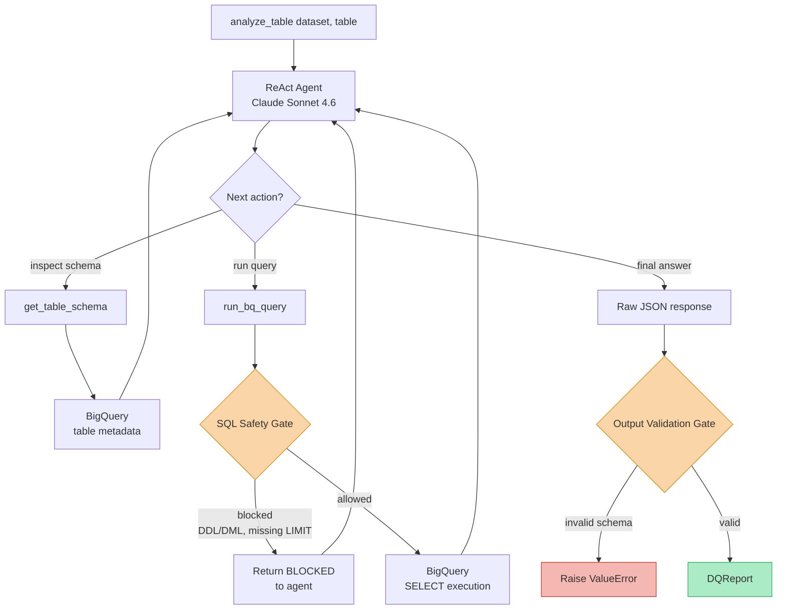

# Data Quality Agent

[](https://github.com/AtillaTRE/project-01-dq-agent/actions/workflows/ci.yml)
[]()

A LangGraph agent that analyzes BigQuery tables and produces structured data quality reports. Powered by Claude (Anthropic) and hardened with a safety harness that blocks dangerous SQL and validates every output.

The project ships **two execution modes**:

- **Direct BigQuery mode** (`src/agent.py`) — the agent writes raw `SELECT` statements against BigQuery, gated by a SQL safety harness.
- **Hybrid Cube mode** (`src/cube_agent.py`) — the agent inspects the BigQuery schema for context but runs all metric queries through the [Cube](https://cube.dev/) semantic layer, gated by a Cube-specific harness. This avoids ad-hoc SQL and keeps queries aligned with governed business definitions.

## Features

- **Automated DQ analysis** — detects nulls, duplicates, and outliers via natural language instructions to Claude
- **SQL safety harness** — allows only `SELECT` statements with a required `LIMIT`; blocks all DDL/DML (`DELETE`, `UPDATE`, `DROP`, etc.)
- **Cube semantic-layer harness** — restricts queries to allow-listed views, caps dimensions and result size, and requires at least one measure
- **Structured output validation** — every agent response is parsed and validated against a `DQReport` Pydantic schema before being returned
- **Structured JSON logging** — all tool calls and analysis steps are logged with metadata (session ID, table, duration, bytes processed)
- **LangSmith tracing** — full execution traces available in the `dq-agent-project` LangSmith project

## Stack

| Layer | Technology |
|---|---|
| Agent framework | LangGraph + LangChain |
| LLM | Claude Sonnet (`claude-sonnet-4-6`) |
| Data warehouse | Google Cloud BigQuery |
| Semantic layer (optional) | Cube Cloud REST API |
| Schema validation | Pydantic v2 |
| Config | python-dotenv |
| Linting | Ruff |
| Type checking | mypy |
| Testing | pytest + pytest-cov |

## Project Structure

```
src/
├── agent.py          # Entry point (BQ mode) — builds the ReAct agent and exposes analyze_table()
├── tools.py          # LangChain tools: get_table_schema, run_bq_query
├── harness.py        # Safety gates: sql_safety_gate, validate_output, DQReport schema
├── cube_agent.py     # Entry point (Cube mode) — hybrid agent: BQ for schema, Cube for metrics
├── cube_tools.py     # LangChain tools: list_cube_metrics, query_cube
├── cube_client.py    # HTTP client for the Cube Cloud REST API
├── cube_harness.py   # Cube-specific gates (allowed views, dimension/limit caps)
├── config.py         # Settings loaded from environment variables
└── logging_config.py # Structured JSON logger setup
tests/                # Harness gate tests — no credentials required
scripts/
└── cube_smoke.py     # Manual smoke check against a live Cube deployment
docs/
AGENTS.md             # System prompt injected into the BQ agent
AGENTS_cube.md        # System prompt injected into the hybrid Cube agent
```

## Execution Flow

The agent runs a **ReAct loop** (reason → act → observe) wrapped by two harness gates: one on every SQL query and one on the final output.


```mermaid
flowchart TD
    A[analyze_table dataset, table] --> B[ReAct Agent<br/>Claude Sonnet 4.6]
    B --> C{Next action?}

    C -->|inspect schema| D[get_table_schema]
    D --> E[BigQuery<br/>table metadata]
    E --> B

    C -->|run query| F[run_bq_query]
    F --> G{SQL Safety Gate}
    G -->|blocked<br/>DDL/DML, missing LIMIT| H[Return BLOCKED<br/>to agent]
    G -->|allowed| I[BigQuery<br/>SELECT execution]
    H --> B
    I --> B

    C -->|final answer| J[Raw JSON response]
    J --> K{Output Validation Gate}
    K -->|invalid schema| L[Raise ValueError]
    K -->|valid| M[DQReport]

    style G fill:#f9d5a7,stroke:#d68910
    style K fill:#f9d5a7,stroke:#d68910
    style L fill:#f5b7b1,stroke:#c0392b
    style M fill:#abebc6,stroke:#27ae60
```

**Step by step:**

1. `analyze_table()` creates a session ID and invokes the agent with a natural-language instruction (e.g. *"Analyze dataset.table: check for nulls, duplicates, outliers"*)
2. The ReAct agent reasons about the task and typically starts by calling `get_table_schema` to understand column types
3. Based on the schema, it issues one or more `run_bq_query` calls — each one is filtered by `sql_safety_gate` before hitting BigQuery
4. When the agent believes it has enough evidence, it returns a JSON response
5. `validate_output` parses the JSON and enforces the `DQReport` Pydantic schema — malformed output raises `ValueError` instead of leaking to the caller

## Output Schema

Every successful run returns a `DQReport`:

```json
{
  "table": "my_dataset.my_table",
  "total_rows": 150000,
  "issues": [
    {
      "severity": "high",
      "field": "email",
      "issue": "15% null values detected",
      "count": 22500
    }
  ],
  "summary": "Found 3 data quality issues. One high-severity null rate on email field."
}
```

Severity levels: `low` | `medium` | `high` | `critical`

`summary` is capped at **500 characters**. The agent is instructed to stay under that
limit in its system prompt, and `validate_output` truncates anything longer rather than
failing the run.

## Quick Start

```bash
# 1. Clone and set up the environment
python -m venv .venv
source .venv/bin/activate
pip install -r requirements.txt

# 2. Configure credentials
cp .env.example .env
# Edit .env with your ANTHROPIC_API_KEY, GOOGLE_CLOUD_PROJECT, BQ_DATASET, BQ_TABLE

# 3. Run (direct BigQuery mode)
python -m src.agent

# Or, run the hybrid Cube mode (requires CUBE_API_URL and CUBE_API_TOKEN in .env)
python -m src.cube_agent
```

Both entry points are Python modules and must be run with `python -m` from the
repository root. `python src/agent.py` does **not** work: it puts `src/` itself on
`sys.path`, so the package-absolute imports (`from src.config import ...`) fail.

### Choosing a mode

| Mode | Entry point | When to use |
|---|---|---|
| Direct BigQuery | `python -m src.agent` | No semantic layer available; you want the agent to write SQL directly. |
| Hybrid Cube | `python -m src.cube_agent` | A Cube semantic layer exists; queries should reuse governed measures/dimensions instead of raw SQL. |

## Docker

The project ships with a multi-stage `Dockerfile` that builds a slim `python:3.11-slim` runtime image, installs dependencies in a separate builder stage for better caching, and runs as a non-root `agent` user.

### Build

```bash
docker build -t dq-agent .
```

### Run

Pass your credentials via an `.env` file:

```bash
docker run --rm --env-file .env dq-agent
```

If you authenticate to BigQuery via a service account key, mount it into the container and point `GOOGLE_APPLICATION_CREDENTIALS` at the mounted path:

```bash
docker run --rm \
  --env-file .env \
  -v $HOME/.config/gcloud/sa-key.json:/secrets/sa-key.json:ro \
  -e GOOGLE_APPLICATION_CREDENTIALS=/secrets/sa-key.json \
  dq-agent
```

### Notes

- The image runs `python -m src.agent` as its default command. For Cube mode, override it:
  `docker run --rm --env-file .env dq-agent python -m src.cube_agent`
- Tests, scripts, docs, `.venv/`, `.git/`, and markdown files (except the two `AGENTS*.md`
  system prompts, which are read at import time) are excluded via `.dockerignore`
- The container runs as a non-root user (`agent`) for security

## Environment Variables

| Variable | Description |
|---|---|
| `ANTHROPIC_API_KEY` | Anthropic API key |
| `GOOGLE_CLOUD_PROJECT` | GCP project ID |
| `BQ_DATASET` | Default BigQuery dataset to analyze |
| `BQ_TABLE` | Default BigQuery table to analyze |
| `CUBE_API_URL` | (Cube mode) Base URL for the Cube Cloud REST API (e.g. `https://<deployment>.cubecloud.dev/cubejs-api/v1`) |
| `CUBE_API_TOKEN` | (Cube mode) JWT used in the `Authorization` header for Cube requests |
| `LANGSMITH_API_KEY` | (optional) LangSmith tracing key |
| `USE_SECRET_MANAGER` | Set to `true` to load secrets from Google Secret Manager |

## Harness Rules

The harness enforces two gates on every agent run:

1. **SQL safety gate** (`sql_safety_gate`) — called before every `run_bq_query` invocation:
   - Only read queries are allowed: the statement must start with `SELECT` or `WITH` (a CTE is still read-only)
   - A `LIMIT` clause is required
   - Keywords `DELETE`, `UPDATE`, `INSERT`, `DROP`, `CREATE`, `ALTER`, `TRUNCATE`, `MERGE` are blocked as whole words, so a column named `created_at` does not trip the `CREATE` rule
   - Statement batches are rejected — a single trailing `;` is fine, but `SELECT ...; DELETE ...` is not

2. **Output validation gate** (`validate_output`) — called on the final agent message:
   - Extracts the first JSON object from the response (strips markdown fences)
   - Validates it against the `DQReport` Pydantic schema
   - Truncates `summary` to 500 characters (`MAX_SUMMARY_LENGTH`) rather than rejecting the report — the analysis is still sound if only the prose ran long
   - Raises `ValueError` if the schema is not satisfied, preventing malformed reports from reaching callers

In **hybrid Cube mode**, `run_bq_query` is replaced by `query_cube`, and a separate `validate_cube_query` gate (in `src/cube_harness.py`) is enforced before each Cube call:

- Query must declare at least one measure
- Maximum of 5 dimensions per query (avoids cartesian explosion)
- `limit` capped at 5000 rows
- Only allow-listed views may be queried — `orders_view`, `products_view`, `stream_events_view`; any other view, and any private cube, is rejected

## Known Limitations

Stated explicitly, because a harness that oversells itself is worse than no harness.

- **`sql_safety_gate` is a lexical gate, not a SQL parser.** It matches keywords with regex on the raw string. A forbidden keyword hidden inside a string literal or a comment (e.g. `SELECT '-- DELETE' ... LIMIT 1`) can still trip a false positive, and a sufficiently exotic dialect construct could in principle evade the check. It is a guardrail against a *mistaken* agent, not a defence against an adversarial one.
- **The real boundary is IAM, not the harness.** In any deployment that matters, the service account should hold read-only BigQuery permissions. The gate exists to catch the agent doing something dumb and to fail loudly and cheaply, before the request ever reaches BigQuery — not to be the only thing standing between an LLM and your warehouse. A proper defence-in-depth version would parse the SQL (e.g. `sqlglot`) and assert the AST contains only read nodes.
- **`LIMIT` is required but not bounded.** The gate requires a `LIMIT` clause; it does not check the value. Row count is capped after the fact by `max_query_rows`, so a large `LIMIT` still scans the data (and costs money) even though few rows are returned.
- **The Cube allow-list is enforced on the view name only.** It does not validate that the referenced measure or dimension actually exists — an invalid member on an allowed view fails at Cube, not at the gate.

## Development

Lint, type-check and test — the same three commands CI runs:

```bash
ruff check src tests scripts
mypy src
pytest
```

The test suite covers the harness gates, which are pure functions with no BigQuery,
Cube or Anthropic dependency. CI therefore runs with **no cloud credentials**.

`scripts/cube_smoke.py` is a manual check against a live Cube deployment. It needs
real credentials, so it lives outside `tests/` and is never collected by pytest:

```bash
python -m scripts.cube_smoke
```
